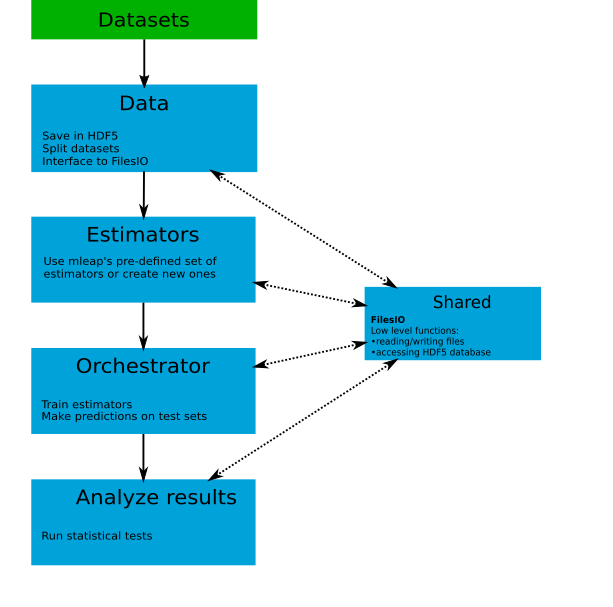

Description of the project
==========================

The goal of ``mlaut`` is to automate the workflow for training and comparing machine learning estimators. The package facilitates the training of a large number of estimators on multiple datasets. It also provides a statistical framework for comparing the performance of the trained estimators.

Overview
--------

``mlaut`` seeks to expand the functionality of the `scikit-learn <http://scikit-learn.org>`_ package. It also aims at providing a seamless integration with other packages such as `scipy <https://www.scipy.org/>`_, `statsmodels <https://www.statsmodels.org>`_ and `scikit-posthocs <https://github.com/maximtrp/scikit-posthocs>`_.

.. note:: Knowledge of all above mentioned packages is not necessarily required in order to work with ``mlaut``. However, in order to make full use of it and be able to expand its functionality understanding of `scikit-learn <http://scikit-learn.org>`_ is highly desirable. 

``mlaut`` is comprised of the following main modules.

* :ref:`estimators`
* :ref:`data`
* :ref:`experiments`
* :ref:`analyze_results`
* :ref:`shared`

The graph below shows on a high level the interaction between the modules.

The user should begin by saving the preprocessed datasets on its hard drive. The ``Data`` module is then evoked for saving the datasets in a HDF5 database. The second step of the process is to instantiate the machine learning estimator objects. The user has the choice of either using the pre-defined estimators in the ``Estimators`` module or defining its own by making use of the :ref:`mlaut_estimator-label`. Once this step is completed the user can proceed to running the experiments by making use of the ``Orchestrator`` module. Once all estimators are trained on all datasets the user can carry out the final step of analyzing the results by evoking the ``Analuze results`` module. The ``Shared`` module provides an interface for reading and writing files as well as for accessing the HDF5 database files and is used by all other modules. This module can also be directly accessed by the end user.

